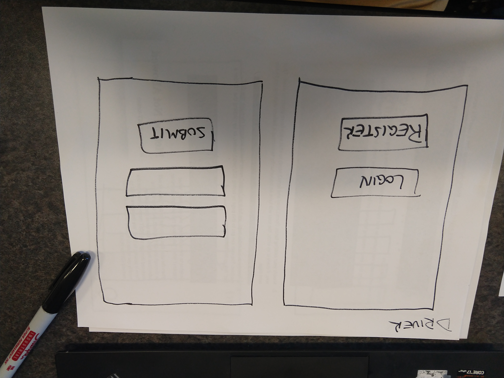
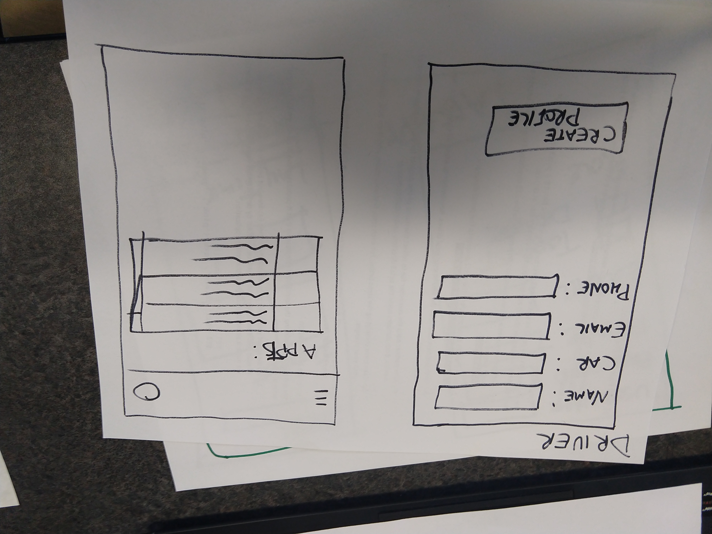
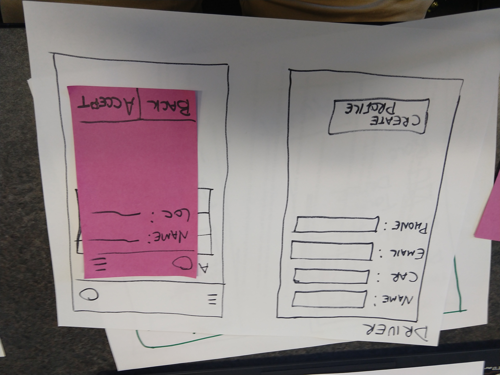
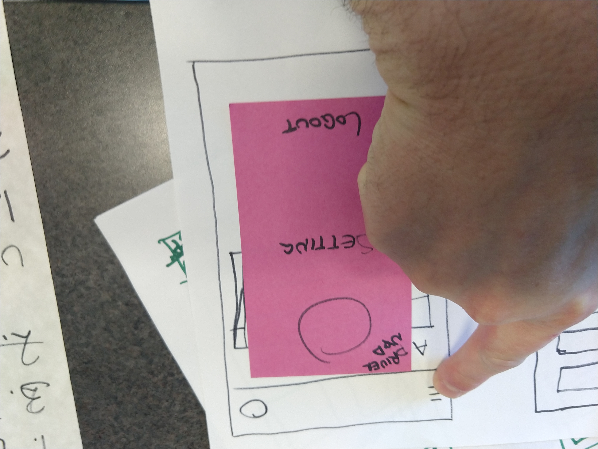
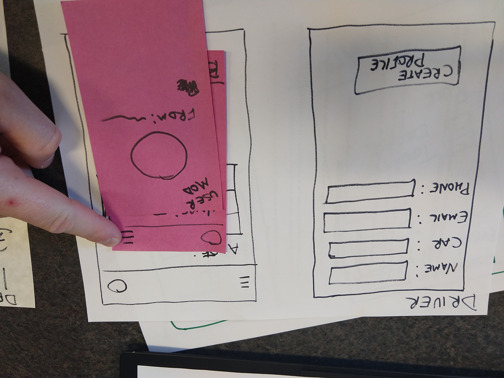
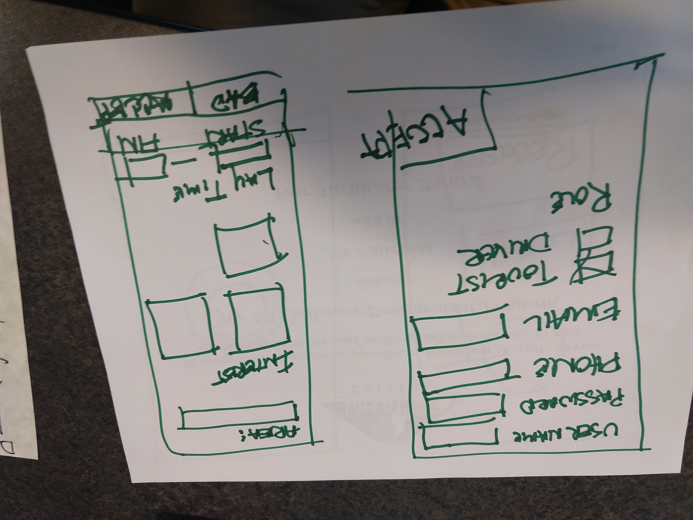
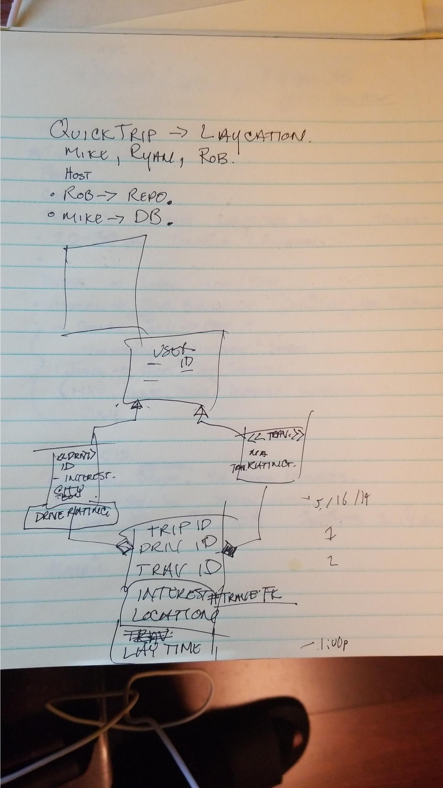

# QT
# 328 Final Project Proposal: QuickTrips

IT328 is a class where we apply full stack Web development at Green River College (IT328) to a group project. QuickTrips is our final group project for IT328\. This is the initial proposal. This proposal will contain the team members, project title, summary, paper prototype pictures, Class Diagrams, and ER Diagrams.

## Team Members:

Michael Britt, Ryan Guelzo, and Robert Hill III.

## Project Title:

Quick Trips

## Description/Summary:

On demand tour guides.

Connecting tourists with guides to give authentic experiences.

Making the most of your layovers.

## 

Paper Prototype Pictures:

Class Diagrams:

ER Diagrams:

---

###051319 Add M.Britt informal Short Meeting:

