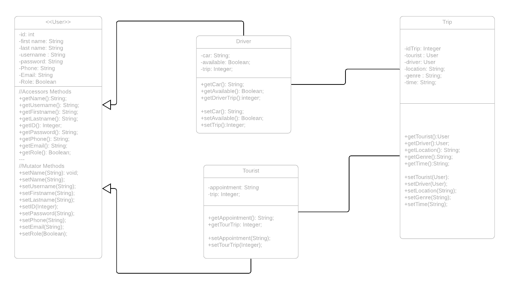
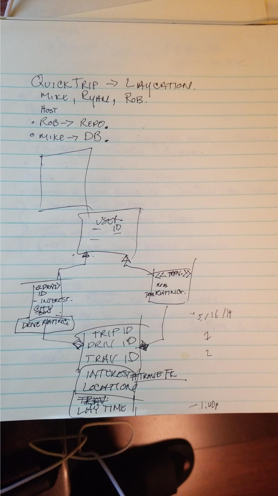

# QT
# 328 Final Project Proposal: QuickTrips

IT328 is a class where we apply full stack Web development at Green River College (IT328) to a group project. QuickTrips is our final group project for IT328\. This is the initial proposal. This proposal will contain the team members, project title, summary, paper prototype pictures, Class Diagrams, and ER Diagrams.

## Team Members:

Michael Britt, Ryan Guelzo, and Robert Hill III.

## Project Title:

Quick Trips

## Description/Summary:

On demand tour guides.

Connecting tourists with guides to give authentic experiences.

Making the most of your layovers.

## 

Class Diagrams:

ER Diagrams:

---

###051319 Add M.Britt informal Short Meeting:

---
# Features of the QuickTrip website

Our team developed QuickTrip, the on demand personal authentic tour app, for our final project. The development team was Ryan G., Michael B., and Robert H. This will discuss features included in our project.

## MVC:

Model, View, and Controller, or MVC, is an application design pattern used in our project. A feature implemented was separating all database/business logic with MVC. All the associated business logic is in the validation.php file, and all the database methods is in the database.php file. Both files are found in the Model directory.

## F3:

Fat-Free Framework, or F3, is an open-source web framework that combines a full featureset with lightweight code base. A feature implemented in this project was routes to all URLs and leverages of templating languages using F3\. The project has F3 routes to each page, and URL found in the index.php file. The project also uses the F3 templating system on the client-side displayed html pages.

## PDO:

PHP Data Objects, or PDO, is a lean, consistent way to access databases. This project features a clearly defined database layer. In the projects database.php file there are prepared statements to Create, Read, Update, and Delete data between the application and the database.

## OOP:

Object Oriented Programming, or OOP, is a programming paradigm based on the concept of "objects", which can contain data. This project features OOP defined classes with database.php, user.php, and user_driver.php. The user_driver class utilizes inheritance from the user class.

## Validation & AJAX:

AJAX, or Asynchronous JavaScript and XML, is incorporated in the project with JavaScript files that handle processing user inputs. AJAX calls are validated with PHP validation function scripts in the model directory validation.php file.
